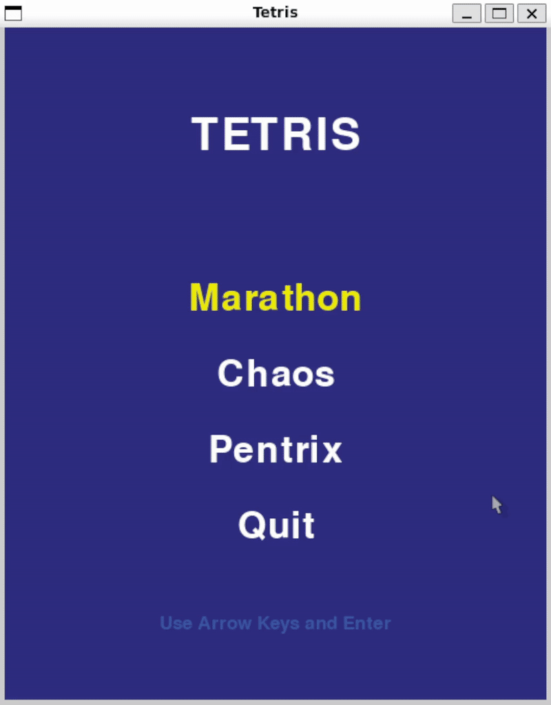
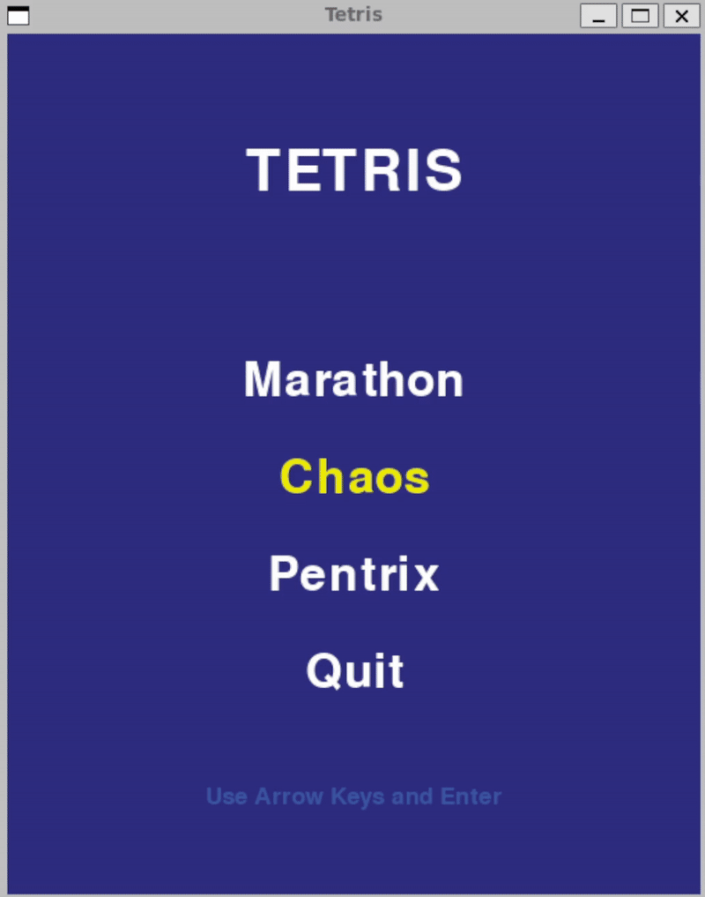
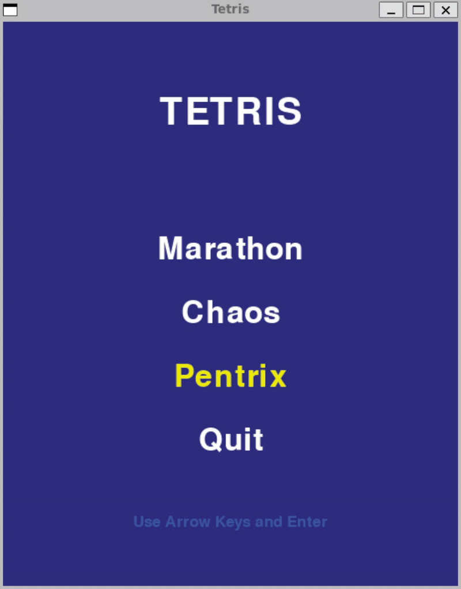
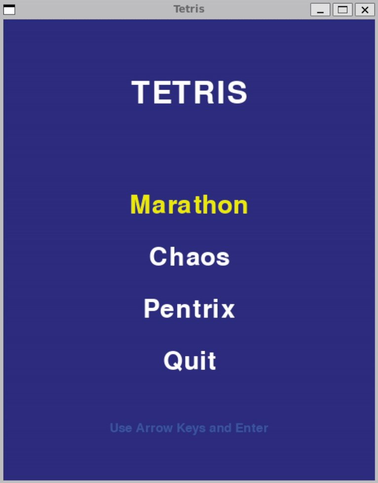

# Tetris!

## Program Summary
This program is an interactive game built using pygame. 
It is a mimic of Tetris with 3 distinct game modes. 

1. Marathon
    - The classic game mode where the speed of which the blocks fall increases at the player clears more lines

    

2. Chaos
    - A spin on Tetris where inputs are inverted, the speed of the falling blocks is random, and the colors of the blocks are also random, to throw off players who are familiar with the game

    

3. Pentrix
    - A game mode where the spawned blocks are no longer Tetriminos (blocks of size 4), but are no Pentominoes (blocks of size 5)

    

When the app is running, use the keyboard to navigate the menu, and play the game

Menu:
- Arrow Keys: used to switch between the different game modes
- Enter Key: used to select the gamemode 




Game:
- Left and Right Arrow Keys: move the current block horizontally along the grid
- Down Key: move the current block once row down the grid
- Space Key: move the current block all the way until a collision is detected
- Up Key and x Key: rotate the block clockwise
- z Key: rotate the block counterclockwise
- Escape Key: exit the current game and open the menu

## Setup & Run Instructions

### Prerequisites
Before running this program, ensure you have the following installed:
- Python3
- pygame

To install pygame:
```bash
pip install pygame
```

To run the base game demo (no game modes), run this command at the root directory of the project:
```bash
python3 base_demo.py
```

To run the complete project (different game modes), run this command at the root directory of the project:
```bash
python3 main.py
```

### Folder Structure
```
EE160_Final_Project/
├── base_tetris/            # Contains files for the base Tetris logic
├── base_demo.py            # Contains code to run the base Tetris game
├── main.py                 # Contains code to run the main program containing all game modes
├── menu.py                 # Contains code for the menu
├── chaos/                  # Contains files that are used for the chaos gamemode
├── marathon/               # Contains files that are used for the marathon gamemode
├── pentix/                 # Contains files that are used for the pentix gamemode
├── .gitignore              # Contains list of files and folders to ignore when committing to git
└── README.md               # This file
```

## Team Member Contributions

### [E-F-III] - Edward Felipe III

#### base_tetris/game.py
- defined game logic that handles selecting blocks, moving blocks, and scoring

#### pentix/
- defined game logic for pentix that inherits from the Game class
- defined the different Pentominos


### [syddonym] - Syndey Son

#### base_tetris/block
- defined block class that all Tetriminos and Pentominos inherit from
- defined the different Tetriminos

#### marathon/
- defined game logic for marathon mode that inherits from Game class
- handled logic for speed at which blocks fall, and included in the GameManager class


### [KaaruAB] - Karl Balajadia

#### base_tetris/grid
- defined grid class that the blocks move around on
- includes logic for checking and clearing lines

#### chaos/
- defined game logic for chaos mode that inherits from Game class
- defined new Chaos pentominos that have random cell colors
- handled logic for randomizing game fall speed, and inverted controls